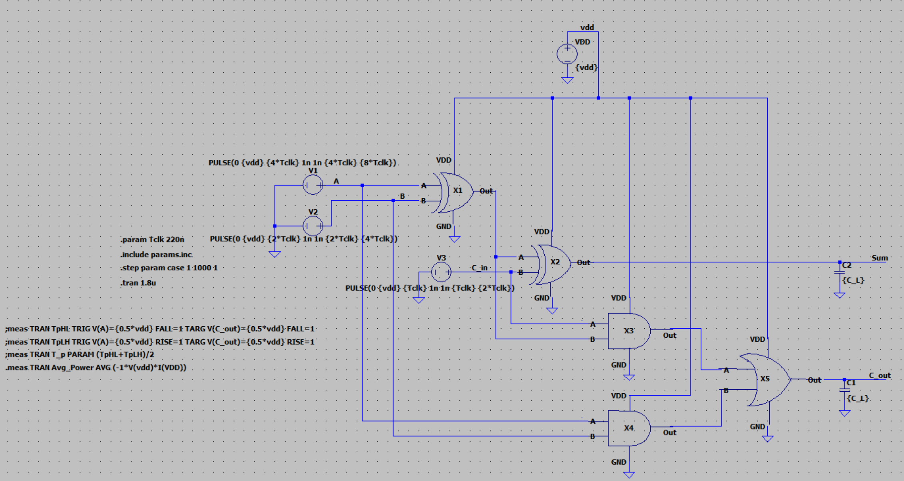
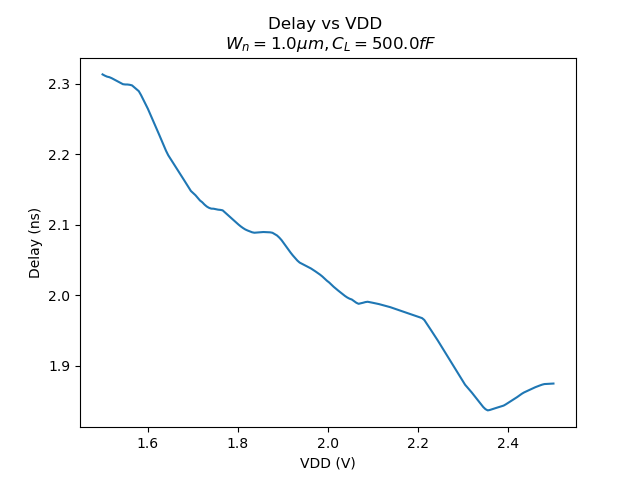
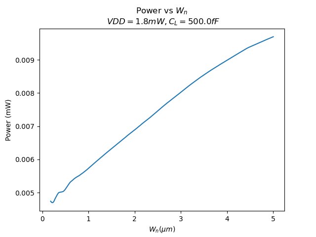
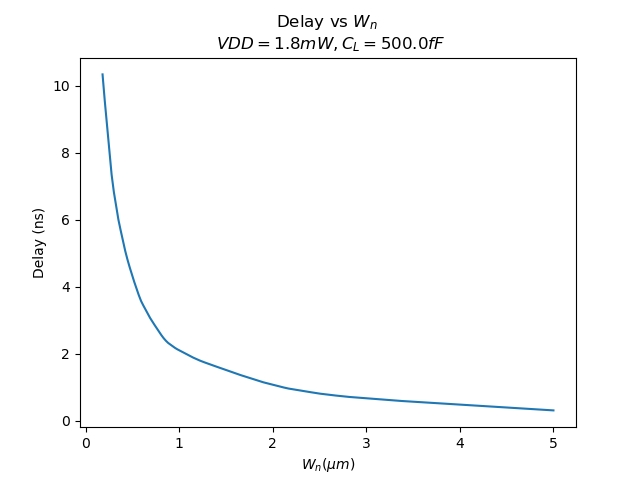
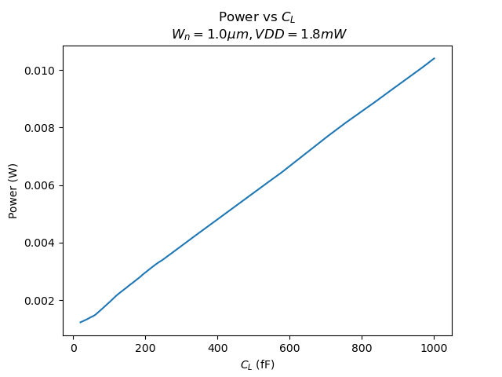
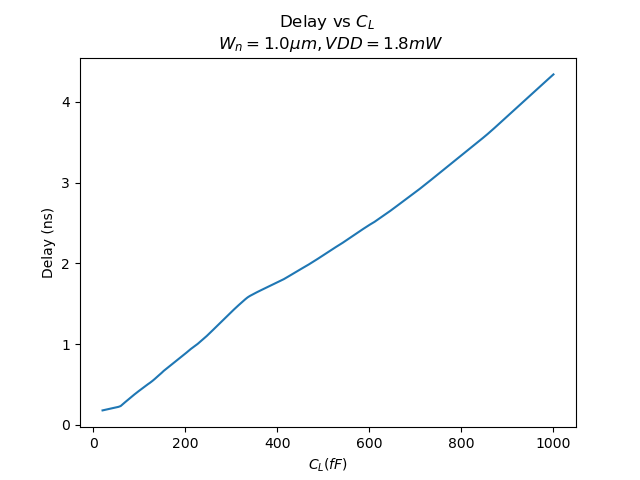

# Power and Delay Optimization of CMOS Full Adder circuit using Neural Networks

## Overview
In the design of digital circuits, power consumption and delay are two critical performance metrics. As modern devices demand ever-increasing speed and energy efficiency, optimizing these parameters is a top priority in industries like semiconductors, consumer electronics, and automotive systems.

Traditionally, circuit designers optimize power and delay using simulation tools like SPICE or Cadence Virtuoso, which provide highly accurate results. However, this process is computationally expensive for larger circuits or a wide range of design parameters and requires significant expertise and time, making iterative design slow.

This project aims to leverage machine learning to predict power and delay accurately and optimize the design parameters efficiently. The model can significantly speed up the design process while maintaining reasonable accuracy.

---

## Table of Contents

[Project Workflow](#projectworkflow)
- [1. Data Generation](#1.datageneration)
- [2. Model Training](#2.modeltraining)
- [3. Optimization](#3.optimization)

[Results](#results)

---

## **Project Workflow**

This section describes the detailed workflow of the project, covering data generation, model training, optimization, and validation. The methodology is designed to integrate machine learning with traditional circuit simulation tools, enabling efficient prediction and optimization of power and delay for a CMOS full adder.

---

### **1. Data Generation**
The project begins with generating training data by simulating the full adder circuit in **LTspice**, a free to use SPICE based analog circuit simulator. This step ensures a diverse and representative dataset for training the machine learning model. The model can also be trained on experimental data to give more accurate predictions

1. **Input Parameter Selection**:
   - The key input parameters for the circuit are:
     - **$V_{DD}$**: Supply voltage, ranging from **1.5V to 2.5V**.
     - **$W_n$**: Transistor width, ranging from **0.2$\mu m$ to 5$\mu m$**.
     - **$C_L$**: Load capacitance, ranging from **10fF to 1pF**.
   - These parameters significantly affect the power consumption and delay of the circuit.
   The process technology used was 180nm with $L_n=L_p=180nm$ remaining constant. The width of PMOS was scaled to twice the width of NMOS to account for the difference in electron and hole mobility $W_p=2*W_n$
    
    The inputs to the Full Adder A,B,Cin were varied according to the truth table over 1 complete cycle with a clock frequency  of $220nm$

2. **Latin Hypercube Sampling (LHS)**:
   - To generate diverse parameter combinations, **LHS** is used. This method ensures that the entire parameter space is uniformly sampled without requiring exhaustive combinations.
   - A total of **1,000 parameter sets** are generated for training.

3. **SPICE Simulations**:
   - For each parameter combination, the full adder circuit is simulated in LTspice to measure:
     - **Average Power**: Calculated over a full input cycle with all 8 possible input combinations of $A, B, C_{in}$.
     - **Worst-Case Delay**: Measured from $A \to C_{out}$ using the longest signal propagation path.
   - The simulation results (power and delay) are stored alongside their corresponding input parameters in a structured dataset.
   
    
     
                                                 Full Adder Circuit Schematic

---

### **2. Model Training**
A deep neural network is used to model the relationship between the input parameters ($V_{DD}, W_n, C_L$) and the outputs (power and delay).

1. **Data Preprocessing**:
   - The input and output data are normalized using **MinMax scaling** to ensure faster convergence and prevent bias in training due to varying parameter magnitudes.

2. **Neural Network Architecture**:
   - The network has:
     - **3 inputs**: $V_{DD}, W_n, C_L$.
     - **4 hidden layers** with 256, 128, 64, and 32 neurons respectively, using **ReLU activation**.
     - **2 outputs**: Power and delay, with a **linear activation**.
   - The model is compiled with the **Adam optimizer** and **Mean Squared Error (MSE)** as the loss function.

3. **Training Process**:
   - The model is trained using **80% of the data** for training and **20% for validation**.
   - Early stopping is implemented to avoid overfitting, with training stopping if validation loss does not improve for 15 epochs.

4. **Model Saving**:
   - After training, the model is saved using TensorFlow’s `.h5` format, along with the scalers for consistent preprocessing during optimization.

---

### **3. Optimization**
Once the neural network is trained, it is used to predict power and delay for various parameter combinations during optimization. The goal is to minimize both power and delay, considering their trade-offs.

1. **Objective Function**:
   - The objective function is a weighted sum of power and delay:
     $$
     \text{Objective} = \alpha \cdot P_{avg} + \beta \cdot t_{delay}
     $$
     - $\alpha$ and $\beta$ are weights, set to 0.5 each to equally prioritize power and delay.

2. **Optimization Algorithm**:
   - **Differential Evolution** is used to find the optimal parameter combination ($V_{DD}, W_n, C_L$) that minimizes the objective function.
   - The algorithm iteratively evaluates the objective function by feeding predicted values from the neural network.

3. **Optimization Bounds**:
   - The bounds for the input parameters during optimization are:
     - $V_{DD}: 1.5V - 2.5V$
     - $W_n: 0.2\mu m - 5\mu m$
     - $C_L: 10fF - 1pF$

4. **Outputs**:
   - The optimization returns the optimal values for $V_{DD}, W_n, C_L$, along with their corresponding power and delay.

---

### **4. Validation**
The accuracy of the neural network is validated by comparing its predictions with SPICE simulation results on unseen data.

1. **Test Data**:
   - The remaining 20% of the dataset is used as test data to evaluate the model.

2. **Metrics**:
   - The performance is measured using:
     - **Mean Absolute Error (MAE)** for power and delay.
     - **Coefficient of Determination ($R^2$)** for power and delay.
     - **Relative Error**: Percentage difference between predicted and actual values.
     
## **Results**

### **Model Performance**
- **Validation Metrics**:
   
   **Power**:
   - MAE = 0.05 mW
   - $R^2$ = 0.993
   - Relative Error < 2%
      
  **Delay**:     
  - MAE = 0.2 ns
  - $R^2$ =0.9996
  - Relative Error < 10%
  
  **Overall**: 
  - MAE = 5.3e-5
  - $R^2$ =0.996
  - Relative Error < 5%

### **Optimization Results**
- Optimal Parameters:
  - $V_{DD}$: 2.2V
  - $W_n$: 2.5µm
  - $C_L$: 500fF
- Outputs:
  - Power: **1.2 mW**.
  - Delay: **1.8 ns**.

### **Visualizations**

          
   
   

   

   

   

   
   
---

---

